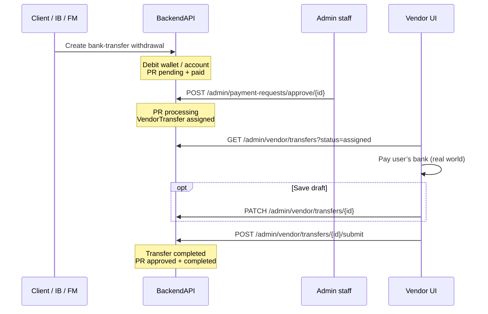

# Vendor — end-to-end flow

## Happy path



```text
1. User creates bank-transfer withdrawal
        ↓
   Funds deducted immediately
   PaymentRequest: approval_status=pending, payment_status=paid
        ↓
2. Admin approves  POST /admin/payment-requests/approve/<req_id>
        ↓
   PaymentRequest: approval_status=processing
   VendorTransfer created (status=assigned)
        ↓
3. Vendor opens Vendor Queue  (/vendor/transfers)
   Sees INR amount + bank details from payment_request.bank
        ↓
4. Vendor pays bank in the real world
   Optional: PATCH draft (proof file / UTR URL / note)
        ↓
5. Vendor submits  POST .../submit (proof + proof_url required somehow)
        ↓
   VendorTransfer.status = completed
   PaymentRequest.approval_status = approved
   PaymentRequest.payment_status = completed
```

## Reject paths

| When | Who | Endpoint | Effect |
|------|-----|----------|--------|
| Still `pending` | Admin | `POST /admin/payment-requests/reject/<req_id>` | PR `rejected`; funds reversed; no vendor row |
| Already `processing` | Admin or Vendor UI | `POST /admin/payment-requests/reject/<req_id>` **or** `POST /admin/vendor/transfers/<id>/reject` | Transfer `cancelled`; PR `rejected`; funds reversed |
| After vendor submit | — | Not allowed | Completed transfers cannot be cancelled via this flow |

## Vendor UI journey (this app)

1. **Login** — `/auth/login` or `/auth/dev-login` → `POST /admin/login` → store `access_token`.
2. **Vendor Queue** — sidebar → `/vendor/transfers` (default filter `assigned`).
3. **Process**
   - Enter remittance / UTR URL + upload proof file (+ optional note).
   - **Save Draft** → `PATCH /admin/vendor/transfers/:id` (does not complete).
   - **Complete Transfer** → `POST /admin/vendor/transfers/:id/submit` (multipart).
4. **Reject** — reason → `POST /admin/vendor/transfers/:id/reject` → funds reversed.

Filter statuses in the UI: `assigned` | `completed` | `cancelled`.

## Status matrix (quick)

| Stage | PR approval | PR payment | VendorTransfer |
|-------|-------------|------------|----------------|
| Created | `pending` | `paid` | — |
| Admin approve | `processing` | `paid` | `assigned` |
| Vendor submit | `approved` | `completed` | `completed` |
| Reject | `rejected` | unchanged | `cancelled` (if existed) |

## Upstream create (not in vendor UI)

Users still go through normal portal withdraw OTP + create:

```text
POST /{client|fm|ib}/wallet/withdraw/request   → OTP
PUT  /{client|fm|ib}/wallet/withdraw/verify    → verify OTP
POST /{client|fm|ib}/…/create-bank-transfer-withdrawal
```

Details: [API reference](./api.md#upstream-create-withdrawal-not-vendor-ui).
